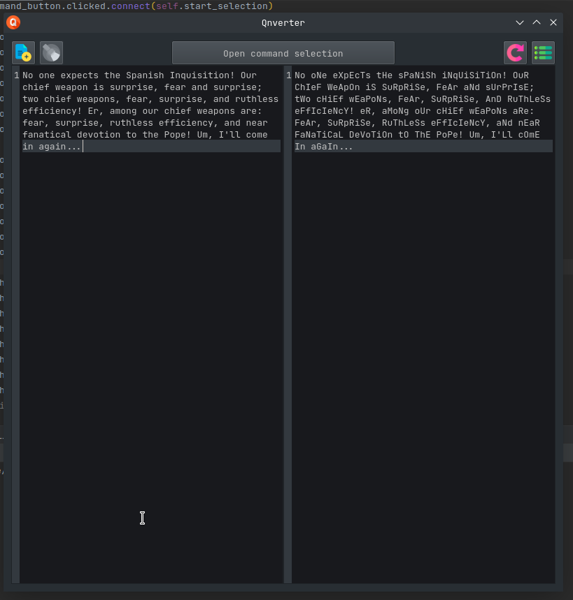
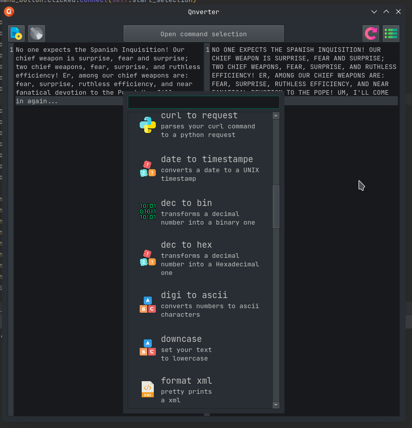

# Qnverter
Python crossplatform application for quick text conversions.

### What is Qnverter
its a quick way of converting any textbased contents in a fast and easy way, wich also means you dont't have to give up your data to some website on the internet just to be able to convert a few json files. 
The entire application is written in pure python and uses the PyQt module to generate the GUI. You can also install new scripts from inside the application with the press of a button.

Im currently planning to add a syntax highlighter (even tough it didn't end well last time i tried) and a proper script repository where everyone can post theor own scripts and contribute to the project. In the meantime feel free to create yoyur own scripts and share them with me as im curious to see how bored people can get nowdays

# Schreenshots

